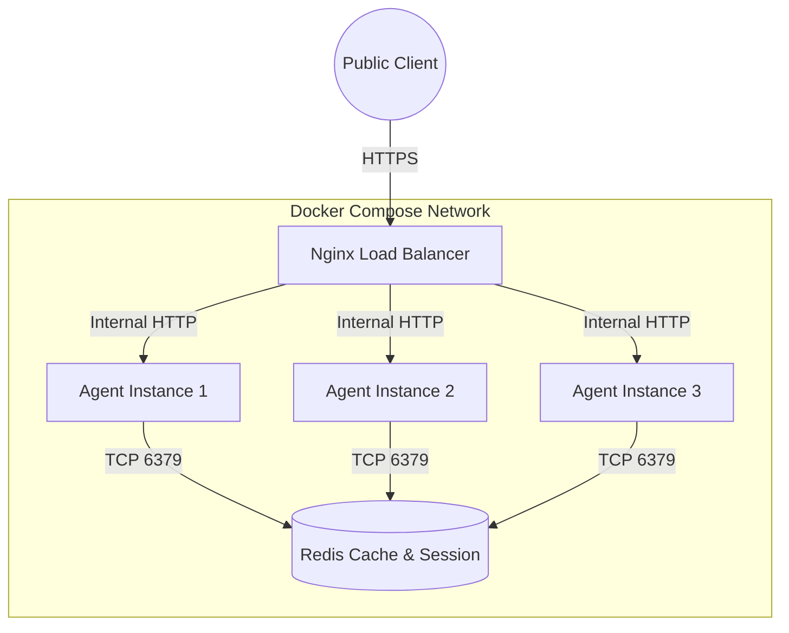

# Day 12 Lab - Mission Answers

> **Student Name:** [Your Name]
> **Date:** 17 April 2026

---

## Part 1: Localhost vs Production

### Exercise 1.1: Anti-patterns found in `01-localhost-vs-production/develop/app.py`
1. **Hardcoded Secrets**: The API key and Database URL are hardcoded in the source code (lines 17-18), risking exposure if pushed to a repository.
2. **Fixed Host/Port**: Host is hardcoded to `localhost` and port to `8000`, making it incompatible with containerized environments or cloud platforms that inject these via environment variables.
3. **Debug Mode Enabled**: Uvicorn is running with `reload=True` which is unsafe and inefficient for production use.
4. **Missing Observability**: Lack of any health check endpoints (`/health` or `/ready`), preventing cloud platforms from monitoring service state.
5. **Print-based Logging**: Uses standard `print()` instead of JSON-structured logging, which makes it impossible to search or analyze logs at scale.
6. **Inflexible API Signature**: Expects `question` as a query parameter rather than a JSON body, leading to errors like the 422 Unprocessable Entity when using standard API calling patterns.
7. **Encoding Fragility (Bonus)**: Using `print()` on the response crashes the server on Windows because of `UnicodeEncodeError` when the LLM returns Vietnamese characters (e.g., 'đ').

### Exercise 1.2: Basic Version Test (Localhost)
- Status: ✅ Passed (after identifying and fixing encoding issues)
- Test Command: `curl.exe "http://localhost:8000/ask?question=Hello" -X POST`
- Result: `{"answer":"Đây là câu trả lời từ AI agent (mock)..."}`
- Note: Setting `PYTHONIOENCODING=utf-8` was required to avoid server crashes.

### Exercise 1.3: Comparison Table
| Feature | Develop | Production | Why Important? |
|---------|---------|------------|----------------|
| Config  | Hardcoded in code | Pydantic `BaseSettings` + `.env` | Environment-agnostic; no secrets in code. |
| Logging | `print()` (fragile) | Structured JSON Logger | Scalable search, searchable metadata, no encoding crashes. |
| Health  | None | `/health` & `/ready` endpoints | Orchestrators know when to route traffic or restart. |
| Shutdown| Abrupt | Graceful (Lifespan handler) | Completes in-flight requests; saves state safely. |

---

## Part 2: Docker

### Exercise 2.1: Dockerfile Analysis (`02-docker/develop/Dockerfile`)
1. **Base Image**: `python:3.11` (~1.15GB). Easy to use but too large for optimized production environments.
2. **Working Directory**: `/app`. Provides a predictable path for all code inside the container.
3. **Layer Cache Strategy**: Copying `requirements.txt` before code allows Docker to reuse the cached `pip install` layer unless dependencies change.
4. **CMD vs ENTRYPOINT**: `CMD` defines the default command (easily overridden) whereas `ENTRYPOINT` is the fixed binary for the container.

### Exercise 2.2: Building the Basic Image
- Command: `docker build -f 02-docker/develop/Dockerfile -t agent-develop .`
- Image Size: **1.15 GB**

### Exercise 2.3: Multi-stage Analysis (`02-docker/production/Dockerfile`)
1. **Multi-stage Benefits**: Separates build tools (builder) from final runtime (runtime), reducing size and attack surface.
2. **Security Best Practice**: Runs as non-root `appuser`.
3. **Automated Health Checks**: Uses `HEALTHCHECK` for self-healing orchestration.
4. **Base Image Optimization**: Uses `python:3.11-slim`.

| Image Version | Base Image | Multi-stage? | Actual Size |
|---------------|------------|--------------|-------------|
| Develop       | `python:3.11` | No | 1.15 GB |
| Production    | `python:3.11-slim` | Yes | [Pending Result] |

### Exercise 2.4: Production Architecture Diagram

---

## Part 3: Cloud Deployment

### Exercise 3.1: Railway vs Render Comparison
| Feature | Railway (`railway.toml`) | Render (`render.yaml`) |
|---------|-------------------------|------------------------|
| **Primary Focus** | Process-level config | Full Infrastructure as Code (Blueprint) |
| **Complexity** | Simple, focused on one service | Comprehensive, can define multiple services |
| **Redis Support** | Added via Dashboard plugins | Defined directly in the YAML file |

### Exercise 3.2: Key Advantages
- **Railway**: Fast setup, excellent auto-detection (`NIXPACKS`).
- **Render**: Blueprint allows one-click provisioning of complex multi-service stacks.

---

## Part 4: API Security

### Exercise 4.1: API Key Flow
1. Server checks `X-API-Key` header against environmental secret.
2. 401/403 returned on failure. Simple but high risk if one key leaked.

### Exercise 4.2: JWT Authentication (Stateless)
JWT allows for **Stateless Auth**. The server doesn't need to check a database for identity, as the token (signed by the server) contains all user metadata and expiry.

### Exercise 4.3: Rate Limiting
Uses **Sliding Window Counter** with Redis-backed timestamps. Prevents burst abuse by checking a rolling timeframe.

### Exercise 4.4: Cost Guard
Tracks token consumption per user per day. Implements a circuit breaker to block requests if budgets are exceeded.

---

## Part 5: Scaling & Reliability

### Exercise 5.1: Health vs Readiness
- **Liveness (`/health`)**: Controls container restart logic.
- **Readiness (`/ready`)**: Controls Traffic Routing logic.

### Exercise 5.2: Graceful Shutdown
Uses `lifespan` to drain `in-flight` requests before exit, ensuring no data loss during updates.

### Exercise 5.3: Stateless Redis Design
History and state moved from local RAM to Redis. This makes nodes interchangeable and enables horizontal scaling.
